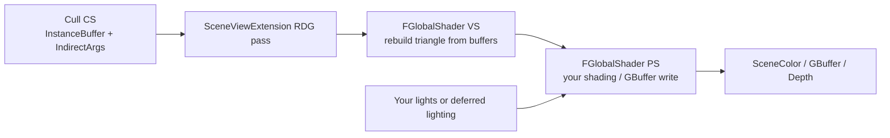

Yes. Drop the mesh-drawing / material path entirely and draw with **global shaders** into UE’s RDG targets. Your cull buffers already produce what that path needs.

## What you have now vs what you want

Today the chain is:

`SceneProxy → FMeshBatch + MaterialRenderProxy → MeshPassProcessor → FMeshMaterialShader + VertexFactory`

Your vertex factory exists only to feed **material** VS/PS (`GetMaterialVertexParameters` / `GetMaterialPixelParameters`). That is why `Material != nullptr` is required in `GetDynamicMeshElements`.

To avoid materials: **do not submit `FMeshBatch`**. Keep the cull CS → `InstanceBuffer` + `IndirectArgs`, then draw with your own `FGlobalShader` VS/PS in a `FSceneViewExtension` RDG pass, binding SceneColor / GBuffer / Depth like any other renderer pass.



---

## Two lighting strategies (pick one)

| Mode | When you draw | What PS writes | Who lights |
|------|---------------|----------------|------------|
| **A. Deferred participant** | After early Z / in BasePass slot | GBuffer A/B/C + Depth | UE deferred lighting (you only fill surface) |
| **B. Fully custom** | After opaque / after lighting | SceneColor (blend or replace) | You, reading SceneDepth / shadow / your light buffers |

Both read/write UE buffers. **B** matches “I bring my own lights” best. **A** if you want UE’s light list for free but still no materials.

---

## Architecture (recommended for your planet)

1. Keep: cull CS, `InstanceBuffer`, `IndirectArgs`, CBT/Voronoi SRVs (already in your extension).
2. Drop from the draw path: `FMeshBatch`, `MaterialRenderProxy`, `FVertexFactory` used-with-materials, `FMeshMaterialShader`.
3. Add: `FSceneViewExtension` that hooks e.g. `PostRenderBasePassDeferred_RenderThread` or `PrePostProcessPass_RenderThread`.
4. In that hook: RDG pass → bind RTs → set VS/PS → `DrawIndexedPrimitiveIndirect`.

Vertex reconstruction moves from `GeoVoronoiIndirectInstancingVertexFactory.ush` into a **standalone** `.usf` included by the global VS (same math, no `FMaterial*`).

---

## Code sketch (illustrative — not applied to the repo)

### 1) Global VS + PS

```cpp
// PlanetDrawShaders.h
#pragma once
#include "GlobalShader.h"
#include "ShaderParameterStruct.h"

BEGIN_SHADER_PARAMETER_STRUCT(FPlanetDrawParameters, )
	SHADER_PARAMETER_STRUCT_REF(FViewUniformShaderParameters, View)
	SHADER_PARAMETER_SRV(StructuredBuffer<FQuadRenderInstance>, InstanceBuffer)
	SHADER_PARAMETER_SRV(Buffer<float4>, VoronoiGeoCenters)
	SHADER_PARAMETER_SRV(Buffer<float4>, CBT_FibonacciPoints)
	SHADER_PARAMETER_SRV(Buffer<uint>,   VoronoiCellColors)
	SHADER_PARAMETER_SRV(Buffer<float>,  ElevationPerSite)
	SHADER_PARAMETER(float, PlanetRadius)
	SHADER_PARAMETER(FVector3f, LightDir)   // your light
	SHADER_PARAMETER(FLinearColor, LightColor)
	// Mode B: read existing scene
	SHADER_PARAMETER_RDG_TEXTURE(Texture2D, SceneDepthTexture)
	SHADER_PARAMETER_SAMPLER(SamplerState, SceneDepthSampler)
	// Mode B output
	RENDER_TARGET_BINDING_SLOTS()
END_SHADER_PARAMETER_STRUCT()

class FPlanetDrawVS : public FGlobalShader
{
	DECLARE_GLOBAL_SHADER(FPlanetDrawVS);
	SHADER_USE_PARAMETER_STRUCT(FPlanetDrawVS, FGlobalShader);
	using FParameters = FPlanetDrawParameters;
	static bool ShouldCompilePermutation(const FGlobalShaderPermutationParameters& P)
	{
		return IsFeatureLevelSupported(P.Platform, ERHIFeatureLevel::SM5);
	}
};

class FPlanetDrawPS : public FGlobalShader
{
	DECLARE_GLOBAL_SHADER(FPlanetDrawPS);
	SHADER_USE_PARAMETER_STRUCT(FPlanetDrawPS, FGlobalShader);
	using FParameters = FPlanetDrawParameters;
	static bool ShouldCompilePermutation(const FGlobalShaderPermutationParameters& P)
	{
		return IsFeatureLevelSupported(P.Platform, ERHIFeatureLevel::SM5);
	}
};
```

```cpp
// PlanetDrawShaders.cpp
IMPLEMENT_GLOBAL_SHADER(FPlanetDrawVS, "/Plugin/DelaunatorPlugin/Private/PlanetDraw.usf", "MainVS", SF_Vertex);
IMPLEMENT_GLOBAL_SHADER(FPlanetDrawPS, "/Plugin/DelaunatorPlugin/Private/PlanetDraw.usf", "MainPS", SF_Pixel);
```

### 2) Shader (no material includes)

```hlsl
// PlanetDraw.usf
#include "/Engine/Public/Platform.ush"
#include "/Engine/Private/Common.ush"

StructuredBuffer<QuadRenderInstance> InstanceBuffer;
Buffer<float4> VoronoiGeoCenters;
Buffer<float4> CBT_FibonacciPoints;
Buffer<uint>   VoronoiCellColors;
Buffer<float>  ElevationPerSite;
float PlanetRadius;
float3 LightDir;
float4 LightColor;

struct FVSIn  { uint VertexId : SV_VertexID; uint InstanceId : SV_InstanceID; };
struct FVSOut
{
	float4 ClipPos : SV_Position;
	float3 WorldPos : TEXCOORD0;
	float3 WorldNrm : TEXCOORD1;
	float4 Color    : TEXCOORD2;
};

float3 ReconstructPosition(float4 Packed) { /* same as your VF */ }

FVSOut MainVS(FVSIn In)
{
	QuadRenderInstance Inst = InstanceBuffer[In.InstanceId];
	float3 V0 = ReconstructPosition(VoronoiGeoCenters[Inst.GeoCenterA]);
	float3 V1 = ReconstructPosition(VoronoiGeoCenters[Inst.GeoCenterB]);
	float3 V2 = ReconstructPosition(CBT_FibonacciPoints[Inst.SiteId]);

	float3 P = (In.VertexId == 0) ? V0 : ((In.VertexId == 1) ? V1 : V2);
	// apply elevation radial lift here (same as current VF)

	float3 N = normalize(cross(V1 - V0, V2 - V0));
	FVSOut O;
	O.WorldPos = P;
	O.WorldNrm = N;
	O.Color = UnpackColor(VoronoiCellColors[Inst.SiteId]);
	O.ClipPos = mul(float4(P, 1), View.WorldToClip);
	return O;
}

// Mode B: lit SceneColor write (you control lighting)
float4 MainPS(FVSOut In) : SV_Target0
{
	float3 N = normalize(In.WorldNrm);
	float  NdL = saturate(dot(N, -LightDir));
	float3 Lit = In.Color.rgb * LightColor.rgb * NdL;
	// optional: sample SceneDepth for soft contact, shadow mask, etc.
	return float4(Lit, 1);
}
```

For **Mode A (GBuffer)**, change PS outputs to match BasePass MRT layout (`SV_Target0..3` = GBufferA/B/C/D) and bind those textures as render targets instead of SceneColor — still no material; you fill the same packed formats DeferredShading expects.

### 3) SceneViewExtension draw

```cpp
class FPlanetDrawViewExtension : public FSceneViewExtensionBase
{
public:
	using FSceneViewExtensionBase::FSceneViewExtensionBase;

	// Mode B: after opaques, into SceneColor
	virtual void PrePostProcessPass_RenderThread(
		FRDGBuilder& GraphBuilder,
		const FSceneView& View,
		const FPostProcessingInputs& Inputs) override
	{
		if (!View.bIsViewInfo) return;
		const FViewInfo& ViewInfo = static_cast<const FViewInfo&>(View);

		FRDGTextureRef SceneColor = Inputs.SceneColor.Texture; // or from FSceneTextures
		FRDGTextureRef SceneDepth = Inputs.SceneDepth.Texture;

		FPlanetDrawParameters* Params = GraphBuilder.AllocParameters<FPlanetDrawParameters>();
		Params->View = View.ViewUniformBuffer;
		Params->InstanceBuffer = CachedInstanceBufferSRV;
		Params->VoronoiGeoCenters = CachedCentersSRV;
		// ... bind rest of SRVs from your CBT resources ...
		Params->PlanetRadius = PlanetRadius;
		Params->LightDir = MyLightDir;
		Params->LightColor = MyLightColor;
		Params->SceneDepthTexture = SceneDepth;
		Params->SceneDepthSampler = TStaticSamplerState<SF_Point>::GetRHI();
		Params->RenderTargets[0] = FRenderTargetBinding(SceneColor, ERenderTargetLoadAction::ELoad);
		// Depth: bind SceneDepth with ELoad + depth test if you want Z-correct compositing

		TShaderMapRef<FPlanetDrawVS> VS(GetGlobalShaderMap(View.GetFeatureLevel()));
		TShaderMapRef<FPlanetDrawPS> PS(GetGlobalShaderMap(View.GetFeatureLevel()));

		GraphBuilder.AddPass(
			RDG_EVENT_NAME("PlanetDraw"),
			Params,
			ERDGPassFlags::Raster,
			[Params, VS, PS, IndirectArgs = CachedIndirectArgs, IndexBuffer = CachedIB](FRHICommandList& RHICmdList)
			{
				FGraphicsPipelineStateInitializer GPSO;
				RHICmdList.ApplyCachedRenderTargets(GPSO);
				GPSO.BoundShader = VS.GetVertexShader();
				GPSO.PixelShader = PS.GetPixelShader();
				GPSO.RasterizerState = TStaticRasterizerState<FM_Solid, CM_CW>::GetRHI();
				GPSO.DepthStencilState = TStaticDepthStencilState<false, CF_DepthNearOrEqual>::GetRHI();
				GPSO.BlendState = TStaticBlendState<>::GetRHI();
				GPSO.PrimitiveType = PT_TriangleList;
				SetGraphicsPipelineState(RHICmdList, GPSO, 0);

				SetShaderParameters(RHICmdList, VS, VS.GetVertexShader(), *Params);
				SetShaderParameters(RHICmdList, PS, PS.GetPixelShader(), *Params);

				RHICmdList.SetStreamSource(0, nullptr, 0); // VS uses SV_VertexID only
				RHICmdList.DrawIndexedPrimitiveIndirect(
					IndexBuffer,      // same 0,1,2 IB you already build
					IndirectArgs,
					0);
			});
	}
};
```

Wire the extension from your component/module (same pattern as registering your current cull extension via `IRendererModule` / `FSceneViewExtensions::NewExtension`).

### 4) What stays from your current code

Reuse as-is conceptually:

- Cull CS output → `InstanceBufferSRV` + `IndirectArgsBuffer`
- `{0,1,2}` index buffer
- All Voronoi/CBT SRVs you already push through `FGeoVoronoiIndirectInstancingUserData`

Stop calling `Collector.AllocateMesh()` for the planet draw. Cull can still run from your existing `BeginFrame`/`SubmitWork` RDG hooks; the **draw** moves into the view extension.

---

## Reading / writing UE buffers

| Buffer | How |
|--------|-----|
| SceneColor | `RENDER_TARGET_BINDING_SLOTS` → write; or `SHADER_PARAMETER_RDG_TEXTURE` → read |
| SceneDepth | bind as DSV for test/write, or as SRV for custom soft Z |
| GBuffer A/B/C | Mode A: MRT write with deferred packing helpers from Engine shaders |
| View / camera | `View` uniform buffer (you already use this pattern) |
| Your planet data | SRVs you already own |
| Lights | your UB/SRV, or Engine `ForwardLightData` / deferred lighting after GBuffer |

---

## Honest constraints

- **True zero materials** ⇒ `FGlobalShader` + manual draw. Vertex factories in UE are built to pair with materials; keeping VF “without materials” still fights the mesh pipeline.
- You **lose** automatic BasePass / shadow caster / velocity / Nanite-style mesh passes unless you add matching custom passes (depth-only shadow draw with the same VS is the usual follow-up).
- You **keep** full control of shading, triangle generation, and which UE textures you touch.
- Engine modification is **not** required for Mode B. Mode A (writing real GBuffer in the right slot) is doable from a plugin via view extensions, but RT binding timing is pickier.

**Practical recommendation for your Voronoi planet:** Mode B — keep cull as today, replace `GetDynamicMeshElements` mesh submission with a SceneViewExtension global-shader indirect draw, light in the PS with your own light data, depth-test against SceneDepth so it sits in the world correctly.

I did not change any files in the solution. If you want this scaffolded next to `IndirectInstancingCore` later, say which lighting mode (A or B) you want.

---

## Using UE5 lights — do I calculate light/shadow myself in USH/USF?

**Short answer:** No, not if you use **Mode A (write GBuffer)**. Yes, if you use Mode B (write SceneColor yourself).

Since you prefer UE5 lights, pick **Mode A**.

### Mode A — UE does lighting and shadows (preferred here)

Your planet PS does **not** loop over lights or sample shadow maps for shading. It only writes **surface data** into the deferred buffers, same job BasePass does for normal meshes:

| You write (in your PS) | UE does later |
|------------------------|---------------|
| Depth | Shadow projection / occlusion |
| GBufferA (world normal, …) | Deferred lighting |
| GBufferB (metallic / specular / roughness, …) | BRDF + light accumulation |
| GBufferC (base color / AO, …) | Lit SceneColor |
| (optional) velocity, custom data | motion blur / other passes |

Flow:

```text
Your draw (BasePass-timed)
  VS: rebuild triangle
  PS: pack albedo / normal / roughness / metal → GBuffer + Depth
        ↓
UE DeferredLightingPass
  reads GBuffer + light list + shadow masks
  writes lit SceneColor
        ↓
you never wrote N·L yourself
```

What you *do* implement in USF:

- Vertex positions / normals (you already have this).
- Encode albedo, normal, roughness, etc. into UE’s **GBuffer packing** (use Engine helpers like `EncodeGBuffer*` / BasePass packing includes — match the current deferred layout for your UE 5.3).
- Bind the real GBuffer + Depth RTs at the right view-extension slot so deferred lighting sees your pixels.

What you do **not** implement:

- Per-light loops
- Attenuation / spot cones / IES
- Shadow-map sampling for *receiving* light (deferred applies that)
- Specular BRDF

### Shadows — one extra draw, still not “lighting math”

| Role | Who |
|------|-----|
| **Receive** shadows from UE lights | Automatic once GBuffer + Depth are correct and deferred lighting runs |
| **Cast** shadows onto other objects | You still need a **depth-only** (or shadow-depth) pass with the same VS + `IndirectArgs`, so the planet exists in the shadow map. That PS is basically empty / depth-only — no light calculations |

So: cast = extra geometry pass; receive = free with Mode A. Neither means reimplementing UE’s light shaders.

### Mode B — you would do it yourself

If you draw straight to SceneColor after lighting, UE lights will **not** automatically affect you. Then either:

- reinvent lighting in your PS, or
- manually bind Engine light/shadow resources and evaluate them yourself (hard, brittle, not worth it if you want UE lights).

Avoid Mode B if the goal is “use UE5 lights.”

### Updated recommendation (given UE lights preference)

Use **Mode A**:

1. Keep cull CS → `InstanceBuffer` + `IndirectArgs`.
2. Draw with `FGlobalShader` VS/PS in a SceneViewExtension timed like BasePass.
3. PS packs GBuffer + writes Depth — **no** light/shadow math in your USF.
4. Add a matching **shadow-depth** indirect draw so the planet casts.
5. Let UE deferred lighting light it with existing directional / point / spot / sky lights.

---

## What does DeferredLightingPass mean?

**DeferredLightingPass** is the UE renderer step that turns GBuffer + lights into lit SceneColor.

In deferred rendering, drawing is split in two:

1. **Geometry / BasePass** — for each visible surface, write *what it is* into screen-sized textures (GBuffer): base color, normal, roughness, metallic, depth, etc. No final lit color yet.
2. **DeferredLightingPass** — for each pixel that has GBuffer data, look up lights (and shadow masks) that affect that pixel, run the BRDF, and **write the lit result into SceneColor**.

So “deferred” means lighting is *deferred* until after all opaque geometry has filled the GBuffer. Your Mode A planet draw is step 1; DeferredLightingPass is step 2 that applies UE lights for you.


---

but what if want height per pixel inside the triangle-mesh?

Then you need either **more geometry** or a **pixel-shader displacement trick**. The flat triangle itself can’t carry independent height at every pixel unless you change how you shade or subdivide it.

### 1. Real geometric height (best for a planet)

Evaluate height in the **VS** on a denser mesh:

- Push CBT / subdivision further so triangles are small, or
- Tessellation / barycentric height sample at each new vertex

Height is still “per vertex,” but vertices are dense enough that it *looks* per-pixel. Silhouettes, shadows, and collision-ish depth all stay correct. This fits Mode A as-is (displace in VS → write GBuffer + Depth).

### 2. True per-pixel *inside* a coarse triangle (PS)

Keep the triangle, and in the **PS**:

1. Sample a height field (texture, noise, or interpolated site elevations + detail).
2. Raymarch / parallax along the view ray in the triangle’s tangent frame (or along the sphere radial direction).
3. Write:
   - perturbed **normal** → GBufferA  
   - optionally **base color** from the hit  
   - **modified depth** (`SV_Depth` / pixel depth offset) so deferred lighting & shadows see the bump

You get per-pixel height appearance and better contact shadows, but **outlines stay the coarse triangle** unless the raymarch also clips (expensive / messy).

### Practical pick for your planet

| Goal | Approach |
|------|----------|
| Correct shape, shadows, orbit silhouette | Subdivide + height in VS (lean on CBT) |
| Extra detail inside already-small tris | PS height + normal (+ optional depth offset) on top of VS elevation |
| Only fake bump, ignore silhouette | Parallax / normal map in PS only |

So yes, you can have height per pixel inside a triangle — via **PS displacement + GBuffer normal/depth**, or by **not leaving the triangle coarse** in the first place. For a Voronoi planet, VS height on CBT mesh is the solid base; PS detail is the optional layer.


---


raymarch each triangle facing camera? fitting for orbit, then switch to triangle subdiv (CBT subdiv) on approach, then disable raymarching when on the ground?

Yes — that’s a solid **distance LOD stack**, with a few caveats so the handoff doesn’t pop or double-displace.

### Proposed ladder

| Range | Geometry | Height detail |
|-------|----------|----------------|
| **Orbit** | Coarse tris (low CBT / site mesh) | PS raymarch (or parallax) inside each front-facing tri |
| **Approach** | CBT subdiv ramps up | Blend: less raymarch, more VS height on new verts |
| **Ground** | CBT dense enough | Raymarch **off**; VS height (+ cheap normal map if needed) |

### Why it fits

- **Orbit:** tris are smaller on screen → fewer pixels × expensive raymarch; you fake detail without millions of tris.
- **Approach:** CBT is built for this — screen-error / distance driven subdiv.
- **Ground:** tris are huge on screen → raymarch would be at its worst cost; real subdivided verts should carry height instead.

### Must-haves

1. **One height function** — same elevation field for VS displace and PS raymarch, or the switch will crack.
2. **Soft blend** — e.g. `RaymarchStrength = saturate((Alt - GroundAlt) / FadeRange)` so you don’t hard-cut.
3. **Don’t stack both at full** — when CBT leaf depth (or edge length in pixels) is good enough, strength → 0. Otherwise you displace twice.
4. **“Facing camera”** — normal backface cull is enough; don’t special-case beyond that unless you do a custom hemisphere pass.

### Caveats

- At **very far** orbit, one **planet-sphere** height raymarch (or just a lit height texture on a coarse mesh) can be cheaper than raymarching every Voronoi tri.
- Raymarch + **depth write** helps deferred contacts; from orbit you can use fewer steps and skip perfect depth.
- Ground: if CBT still isn’t dense enough, prefer **more subdiv** or a **normal map**, not keeping full raymarch.

So: orbit raymarch → approach CBT + fade raymarch → ground CBT only is a coherent plan; drive it with altitude / screen-space edge length, and share one height source across both paths.